# DARE Framework 设计文档

> 基于 `dare_framework/` 与 `examples/05-dare-coding-agent-enhanced/` 源码分析而成

---

## 1. 架构概览

### 1.1 核心定位

DARE Framework 是一个**确定性 Agent 运行时引擎**，通过五层编排循环实现任务分解、规划、执行与验证。支持三种运行模式：完整五层模式（Session → Milestone → Plan → Execute → Tool）、ReAct 模式（Execute → Tool）、简单模式（仅模型生成）。

### 1.2 架构图

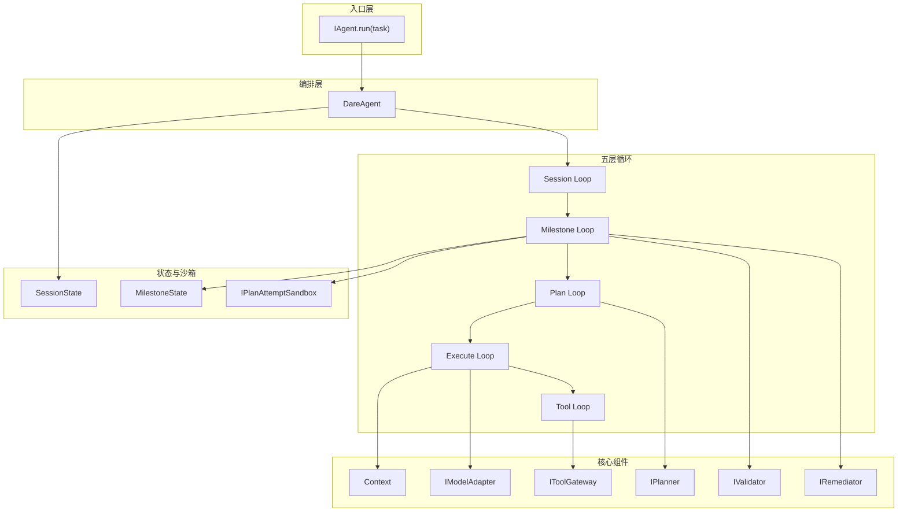
```mermaid
flowchart TB
    subgraph Entry["入口层"]
        IAgent["IAgent.run(task)"]
    end

    subgraph Orchestration["编排层"]
        DareAgent["DareAgent"]
    end

    subgraph Loops["五层循环"]
        L1["Session Loop"]
        L2["Milestone Loop"]
        L3["Plan Loop"]
        L4["Execute Loop"]
        L5["Tool Loop"]
    end

    subgraph Core["核心组件"]
        Context["Context"]
        Model["IModelAdapter"]
        Tools["IToolGateway"]
        Planner["IPlanner"]
        Validator["IValidator"]
        Remediator["IRemediator"]
    end

    subgraph State["状态与沙箱"]
        SessionState["SessionState"]
        MilestoneState["MilestoneState"]
        Sandbox["IPlanAttemptSandbox"]
    end

    IAgent --> DareAgent
    DareAgent --> L1
    L1 --> L2
    L2 --> L3
    L3 --> L4
    L4 --> L5
    L5 --> Tools
    L3 --> Planner
    L2 --> Validator
    L2 --> Remediator
    L4 --> Model
    L4 --> Context
    DareAgent --> SessionState
    L2 --> MilestoneState
    L2 --> Sandbox
```

### 1.3 模式选择逻辑

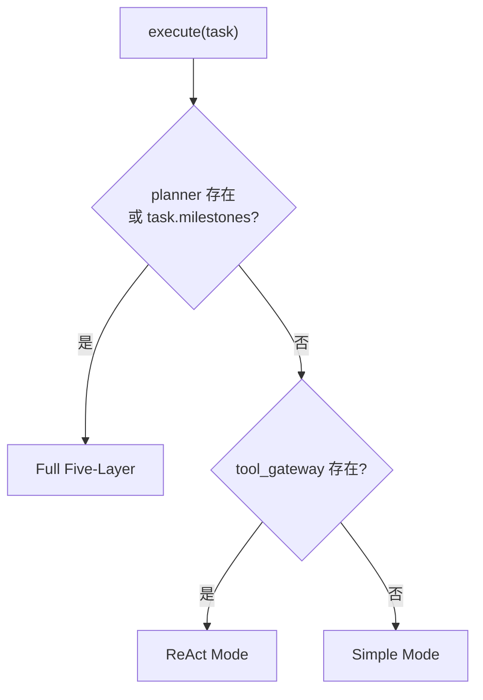
```mermaid
flowchart TD
    A["execute(task)"] --> B{"planner 存在<br/>或 task.milestones?"}
    B -->|是| C["Full Five-Layer"]
    B -->|否| D{"tool_gateway 存在?"}
    D -->|是| E["ReAct Mode"]
    D -->|否| F["Simple Mode"]
```

---

## 2. 模块说明

### 2.1 模块依赖关系

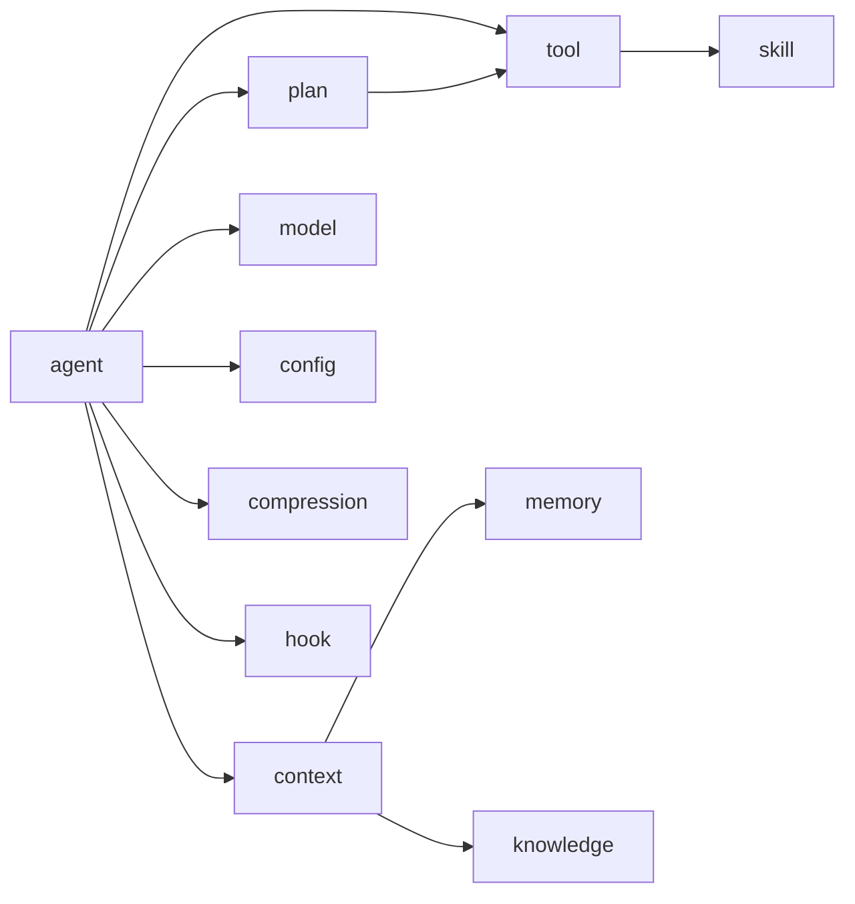
```mermaid
flowchart LR
    agent[agent]
    plan[plan]
    context[context]
    model[model]
    tool[tool]
    config[config]
    compression[compression]
    hook[hook]
    memory[memory]
    knowledge[knowledge]
    skill[skill]

    agent --> plan
    agent --> context
    agent --> model
    agent --> tool
    agent --> config
    agent --> compression
    agent --> hook

    context --> memory
    context --> knowledge
    plan --> tool
    tool --> skill
```

### 2.2 Agent 模块

| 组件 | 路径 | 职责 |
|------|------|------|
| `IAgent` | `agent/kernel.py` | 运行时最小契约，`run(task)` 为统一入口 |
| `BaseAgent` | `agent/base_agent.py` | 抽象基类，提供 skill 挂载与 `_execute` 抽象 |
| `DareAgent` | `agent/_internal/five_layer.py` | 五层编排实现，支持三种模式切换 |
| `IAgentOrchestration` | `agent/interfaces.py` | 可插拔编排策略接口 |
| `DareAgentBuilder` | `agent/_internal/builder.py` | 五层 Agent 构建器 |
| `ReactAgentBuilder` | `agent/_internal/builder.py` | ReAct Agent 构建器 |
| `SimpleChatAgentBuilder` | `agent/_internal/builder.py` | 简单聊天 Agent 构建器 |
| `SessionState` / `MilestoneState` | `agent/_internal/orchestration.py` | 会话与里程碑状态 |
| `DefaultPlanAttemptSandbox` | `agent/_internal/sandbox.py` | STM 快照/回滚，用于计划失败隔离 |

### 2.3 Plan 模块

| 组件 | 路径 | 职责 |
|------|------|------|
| `Task` | `plan/types.py` | 顶层任务，含 description、milestones |
| `Milestone` | `plan/types.py` | 子目标，含 milestone_id、description、success_criteria |
| `ProposedPlan` / `ValidatedPlan` | `plan/types.py` | 非可信规划与可信规划 |
| `ProposedStep` / `ValidatedStep` | `plan/types.py` | 非可信步骤与可信步骤（含 risk_level） |
| `VerifyResult` | `plan/types.py` | 验证结果 |
| `IPlanner` | `plan/interfaces.py` | 规划器，`plan()` / `decompose()` |
| `IValidator` | `plan/interfaces.py` | 校验器，`validate_plan()` / `verify_milestone()` |
| `IRemediator` | `plan/interfaces.py` | 失败修复器，`remediate()` |
| `DefaultPlanner` | `plan/_internal/default_planner.py` | LLM 驱动，证据型规划 |
| `RegistryPlanValidator` | `plan/_internal/registry_validator.py` | 基于能力注册表校验 |
| `CompositeValidator` | `plan/_internal/composite_validator.py` | 多校验器组合 |
| `DefaultRemediator` | `plan/_internal/default_remediator.py` | LLM 驱动的反思与调整 |

### 2.4 Context 模块

| 组件 | 路径 | 职责 |
|------|------|------|
| `IContext` | `context/kernel.py` | 上下文契约 |
| `IRetrievalContext` | `context/kernel.py` | STM/LTM/Knowledge 统一检索接口 |
| `Context` | `context/_internal/context.py` | 默认实现：STM、Budget、assemble、listing_tools |
| `AssembledContext` | `context/types.py` | 组装结果：messages、tools、sys_prompt、metadata |
| `Message` | `context/types.py` | 消息结构 |
| `Budget` | `context/types.py` | 资源预算（tokens、cost、tool_calls、time） |

### 2.5 Tool 模块

| 组件 | 路径 | 职责 |
|------|------|------|
| `IToolGateway` | `tool/kernel.py` | 能力注册表门面，`list_capabilities()` / `invoke()` |
| `IToolManager` | `tool/kernel.py` | 工具注册与调用管理 |
| `IExecutionControl` | `tool/kernel.py` | HITL 控制：pause/resume/checkpoint |
| `ITool` | `tool/interfaces.py` | 工具实现契约 |
| `IToolProvider` | `tool/interfaces.py` | 工具来源 |
| `CapabilityDescriptor` | `tool/types.py` | 能力描述（id、metadata、risk_level） |
| `ToolResult` | `tool/types.py` | 执行结果（success、output、error、evidence） |
| `ToolManager` | `tool/_internal/managers/tool_manager.py` | 注册表与调用实现 |

### 2.6 Model 模块

| 组件 | 路径 | 职责 |
|------|------|------|
| `IModelAdapter` | `model/kernel.py` | 模型适配器，`generate(model_input)` |
| `ModelInput` | `model/types.py` | 输入：messages、tools、metadata |
| `ModelResponse` | `model/types.py` | 输出：content、tool_calls、usage |

### 2.7 Config 模块

| 组件 | 路径 | 职责 |
|------|------|------|
| `Config` | `config/types.py` | 统一配置：llm、mcp_paths、allowtools、allowmcps、knowledge、long_term_memory、skill_mode 等 |
| `IConfigProvider` | `config/kernel.py` | 配置提供者 |

### 2.8 Compression 模块

| 组件 | 路径 | 职责 |
|------|------|------|
| `compress_context()` | `compression/core.py` | 同步轻量压缩：truncate、dedup_then_truncate、summary_preview |
| `compress_context_llm_summary()` | `compression/core.py` | 异步 LLM 语义摘要压缩 |

### 2.9 Hook 模块

| 组件 | 路径 | 职责 |
|------|------|------|
| `HookPhase` | `hook/types.py` | 生命周期阶段枚举 |
| `HookExtensionPoint` | `hook/_internal/hook_extension_point.py` | 钩子分发 |

---

## 3. 设计原理

### 3.1 五层编排

五层循环将任务分解、规划、执行与工具调用解耦，支持失败隔离与重试：

1. **Session Loop**：顶层任务生命周期，初始化 SessionContext，分解或使用预定义 milestones，依次执行里程碑。
2. **Milestone Loop**：子目标跟踪，每次尝试：创建 STM 快照 → Plan Loop → Execute Loop → 验证 → 成功则提交快照，失败则回滚并调用 Remediator。
3. **Plan Loop**：规划生成与校验，由 Planner 产出 ProposedPlan，Validator 转为 ValidatedPlan；失败可重试。
4. **Execute Loop**：模型驱动执行，循环调用 model.generate()，处理 tool_calls，直至无调用或达到迭代上限。
5. **Tool Loop**：单次工具调用，通过 IToolGateway.invoke() 执行，支持 done_predicate、budget。

### 3.2 可信与不可信分离

- **ProposedPlan / ProposedStep**：来自 LLM，不可信，不得直接用于安全决策。
- **ValidatedPlan / ValidatedStep**：由 Validator 基于能力注册表派生 risk_level 等元数据，作为可信来源。
- **RegistryPlanValidator**：从 IToolGateway 获取能力列表，校验 capability_id 存在性，并将 risk_level 等从注册表覆盖规划输出。

### 3.3 沙箱与状态隔离

- **IPlanAttemptSandbox**：对 STM 做快照（create_snapshot）、回滚（rollback）、提交（commit）。
- 每次 milestone 尝试前创建快照，验证失败或遇到 plan tool 时回滚，验证成功时提交，保证失败尝试不污染上下文。

### 3.4 上下文组装与压缩

- **assemble()**：从 STM 取消息、从 tool_provider 取工具列表、合并 sys_prompt 与 skill，产出 AssembledContext。
- **compress_context()**：在 plan/execute/react/simple_chat 各阶段调用，通过 truncate、dedup、summary_preview 控制上下文长度。

---

## 4. 算法说明

### 4.1 上下文压缩算法

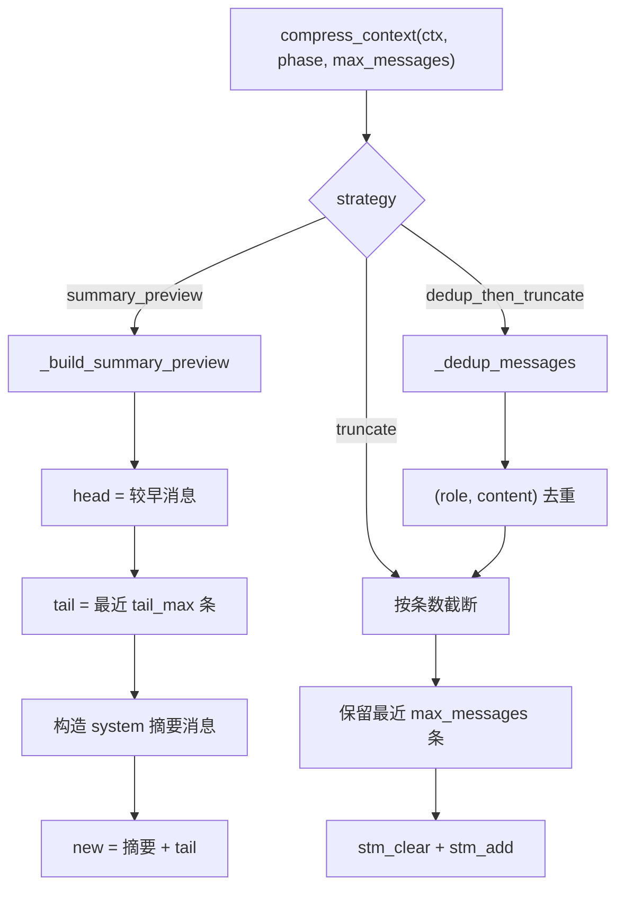
```mermaid
flowchart TD
    A["compress_context(ctx, phase, max_messages)"] --> B{"strategy"}
    B -->|summary_preview| C["_build_summary_preview"]
    B -->|dedup_then_truncate| D["_dedup_messages"]
    B -->|truncate| E["按条数截断"]

    C --> C1["head = 较早消息"]
    C1 --> C2["tail = 最近 tail_max 条"]
    C2 --> C3["构造 system 摘要消息"]
    C3 --> C4["new = 摘要 + tail"]

    D --> D1["(role, content) 去重"]
    D1 --> E

    E --> F["保留最近 max_messages 条"]
    F --> G["stm_clear + stm_add"]
```

**去重**：`_dedup_messages` 按 `(role, content)` 哈希去重，保留首次出现。  
**摘要预览**：`_build_summary_preview` 将较早消息折叠为一条 system 消息（启发式摘要，不调 LLM），保留最近若干条原始消息。

### 4.2 计划校验算法（RegistryPlanValidator）

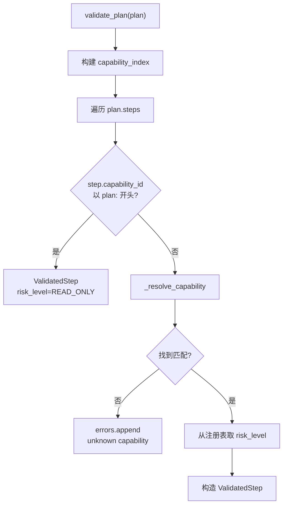
```mermaid
flowchart TD
    A["validate_plan(plan)"] --> B["构建 capability_index"]
    B --> C["遍历 plan.steps"]
    C --> D{"step.capability_id<br/>以 plan: 开头?"}
    D -->|是| E["ValidatedStep<br/>risk_level=READ_ONLY"]
    D -->|否| F["_resolve_capability"]
    F --> G{"找到匹配?"}
    G -->|否| H["errors.append<br/>unknown capability"]
    G -->|是| I["从注册表取 risk_level"]
    I --> J["构造 ValidatedStep"]
```

### 4.3 验证算法（FileExistsValidator 示例）

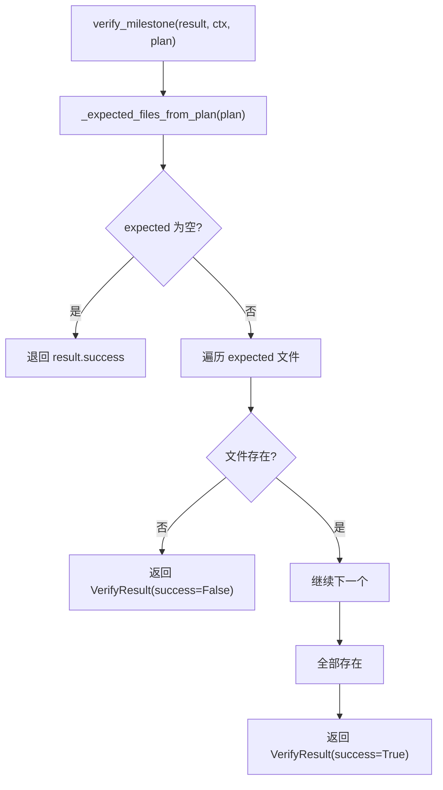
```mermaid
flowchart TD
    A["verify_milestone(result, ctx, plan)"] --> B["_expected_files_from_plan(plan)"]
    B --> C{"expected 为空?"}
    C -->|是| D["退回 result.success"]
    C -->|否| E["遍历 expected 文件"]
    E --> F{"文件存在?"}
    F -->|否| G["返回 VerifyResult(success=False)"]
    F -->|是| H["继续下一个"]
    H --> I["全部存在"]
    I --> J["返回 VerifyResult(success=True)"]
```

---

## 5. 流程图

### 5.1 完整五层执行流程

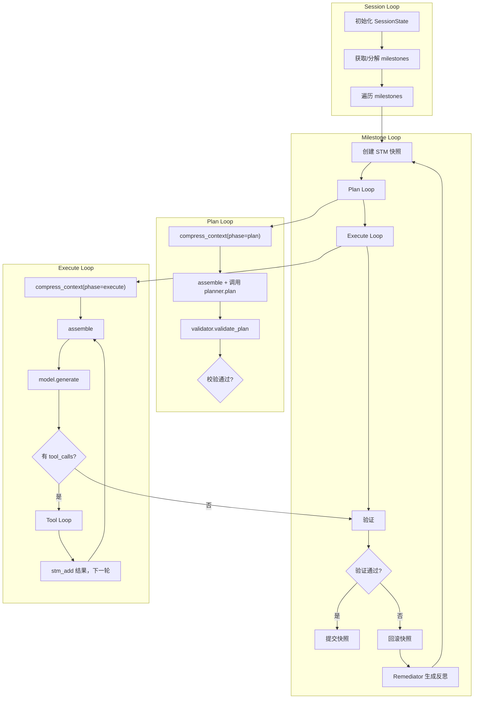
```mermaid
flowchart TB
    subgraph Session["Session Loop"]
        S1["初始化 SessionState"]
        S2["获取/分解 milestones"]
        S3["遍历 milestones"]
    end

    subgraph Milestone["Milestone Loop"]
        M1["创建 STM 快照"]
        M2["Plan Loop"]
        M3["Execute Loop"]
        M4["验证"]
        M5{"验证通过?"}
        M6["提交快照"]
        M7["回滚快照"]
        M8["Remediator 生成反思"]
    end

    subgraph Plan["Plan Loop"]
        P1["compress_context(phase=plan)"]
        P2["assemble + 调用 planner.plan"]
        P3["validator.validate_plan"]
        P4{"校验通过?"}
    end

    subgraph Execute["Execute Loop"]
        E1["compress_context(phase=execute)"]
        E2["assemble"]
        E3["model.generate"]
        E4{"有 tool_calls?"}
        E5["Tool Loop"]
        E6["stm_add 结果，下一轮"]
    end

    S1 --> S2 --> S3
    S3 --> M1 --> M2 --> M3 --> M4 --> M5
    M5 -->|是| M6
    M5 -->|否| M7 --> M8 --> M1
    M2 --> P1 --> P2 --> P3 --> P4
    M3 --> E1 --> E2 --> E3 --> E4
    E4 -->|是| E5 --> E6 --> E2
    E4 -->|否| M4
```

### 5.2 ReAct 执行流程

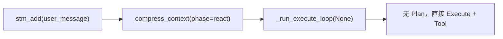
```mermaid
flowchart LR
    A["stm_add(user_message)"] --> B["compress_context(phase=react)"]
    B --> C["_run_execute_loop(None)"]
    C --> D["无 Plan，直接 Execute + Tool"]
```

### 5.3 Builder 构建流程（DareAgentBuilder）

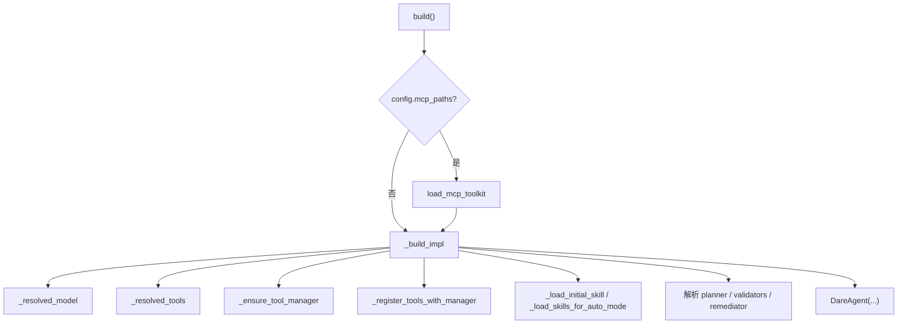
```mermaid
flowchart TD
    A["build()"] --> B{"config.mcp_paths?"}
    B -->|是| C["load_mcp_toolkit"]
    B -->|否| D["_build_impl"]
    C --> D
    D --> E["_resolved_model"]
    D --> F["_resolved_tools"]
    D --> G["_ensure_tool_manager"]
    D --> H["_register_tools_with_manager"]
    D --> I["_load_initial_skill / _load_skills_for_auto_mode"]
    D --> J["解析 planner / validators / remediator"]
    D --> K["DareAgent(...)"]
```

---

## 6. 类图

### 6.1 Agent 与 Plan 核心类

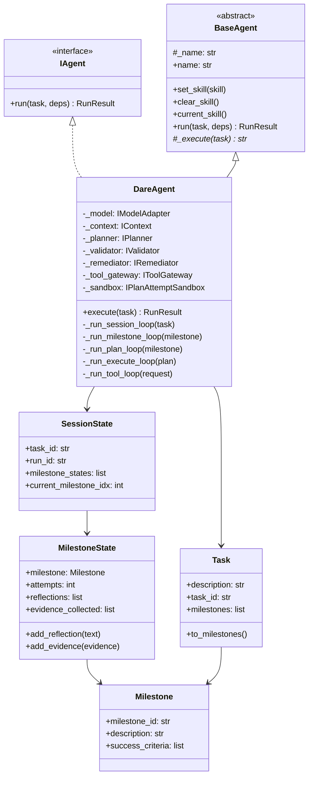
```mermaid
classDiagram
    class IAgent {
        <<interface>>
        +run(task, deps) RunResult
    }
    class BaseAgent {
        <<abstract>>
        #_name: str
        +name: str
        +set_skill(skill)
        +clear_skill()
        +current_skill()
        +run(task, deps) RunResult
        #_execute(task) str*
    }
    class DareAgent {
        -_model: IModelAdapter
        -_context: IContext
        -_planner: IPlanner
        -_validator: IValidator
        -_remediator: IRemediator
        -_tool_gateway: IToolGateway
        -_sandbox: IPlanAttemptSandbox
        +execute(task) RunResult
        -_run_session_loop(task)
        -_run_milestone_loop(milestone)
        -_run_plan_loop(milestone)
        -_run_execute_loop(plan)
        -_run_tool_loop(request)
    }
    class Task {
        +description: str
        +task_id: str
        +milestones: list
        +to_milestones()
    }
    class Milestone {
        +milestone_id: str
        +description: str
        +success_criteria: list
    }
    class SessionState {
        +task_id: str
        +run_id: str
        +milestone_states: list
        +current_milestone_idx: int
    }
    class MilestoneState {
        +milestone: Milestone
        +attempts: int
        +reflections: list
        +evidence_collected: list
        +add_reflection(text)
        +add_evidence(evidence)
    }

    IAgent <|.. DareAgent
    BaseAgent <|-- DareAgent
    DareAgent --> Task
    DareAgent --> SessionState
    SessionState --> MilestoneState
    MilestoneState --> Milestone
    Task --> Milestone
```

### 6.2 Plan 接口与实现

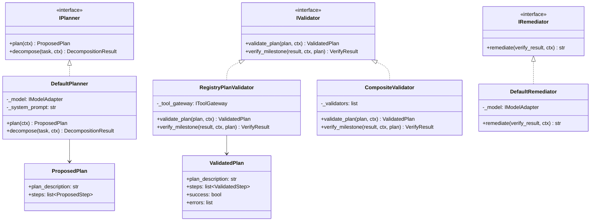
```mermaid
classDiagram
    class IPlanner {
        <<interface>>
        +plan(ctx) ProposedPlan
        +decompose(task, ctx) DecompositionResult
    }
    class IValidator {
        <<interface>>
        +validate_plan(plan, ctx) ValidatedPlan
        +verify_milestone(result, ctx, plan) VerifyResult
    }
    class IRemediator {
        <<interface>>
        +remediate(verify_result, ctx) str
    }
    class DefaultPlanner {
        -_model: IModelAdapter
        -_system_prompt: str
        +plan(ctx) ProposedPlan
        +decompose(task, ctx) DecompositionResult
    }
    class RegistryPlanValidator {
        -_tool_gateway: IToolGateway
        +validate_plan(plan, ctx) ValidatedPlan
        +verify_milestone(result, ctx, plan) VerifyResult
    }
    class CompositeValidator {
        -_validators: list
        +validate_plan(plan, ctx) ValidatedPlan
        +verify_milestone(result, ctx, plan) VerifyResult
    }
    class DefaultRemediator {
        -_model: IModelAdapter
        +remediate(verify_result, ctx) str
    }
    class ProposedPlan {
        +plan_description: str
        +steps: list~ProposedStep~
    }
    class ValidatedPlan {
        +plan_description: str
        +steps: list~ValidatedStep~
        +success: bool
        +errors: list
    }

    IPlanner <|.. DefaultPlanner
    IValidator <|.. RegistryPlanValidator
    IValidator <|.. CompositeValidator
    IRemediator <|.. DefaultRemediator
    DefaultPlanner --> ProposedPlan
    RegistryPlanValidator --> ValidatedPlan
```

### 6.3 Context 与 Tool

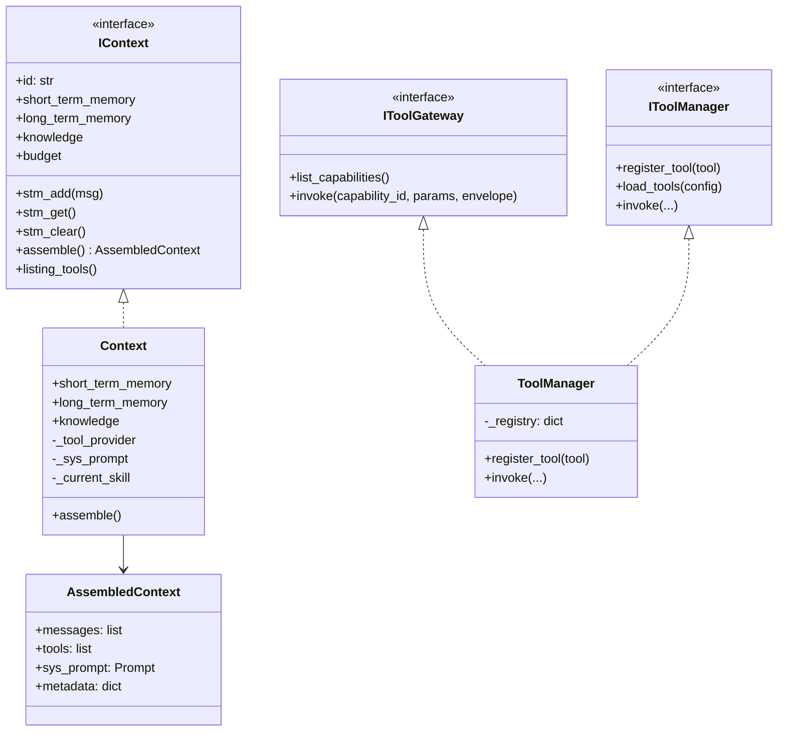
```mermaid
classDiagram
    class IContext {
        <<interface>>
        +id: str
        +short_term_memory
        +long_term_memory
        +knowledge
        +budget
        +stm_add(msg)
        +stm_get()
        +stm_clear()
        +assemble() AssembledContext
        +listing_tools()
    }
    class Context {
        +short_term_memory
        +long_term_memory
        +knowledge
        -_tool_provider
        -_sys_prompt
        -_current_skill
        +assemble()
    }
    class IToolGateway {
        <<interface>>
        +list_capabilities()
        +invoke(capability_id, params, envelope)
    }
    class IToolManager {
        <<interface>>
        +register_tool(tool)
        +load_tools(config)
        +invoke(...)
    }
    class ToolManager {
        -_registry: dict
        +register_tool(tool)
        +invoke(...)
    }
    class AssembledContext {
        +messages: list
        +tools: list
        +sys_prompt: Prompt
        +metadata: dict
    }

    IContext <|.. Context
    IToolGateway <|.. ToolManager
    IToolManager <|.. ToolManager
    Context --> AssembledContext
```

---

## 7. 时序图

### 7.1 五层模式：Session → Milestone → Plan → Execute → Tool

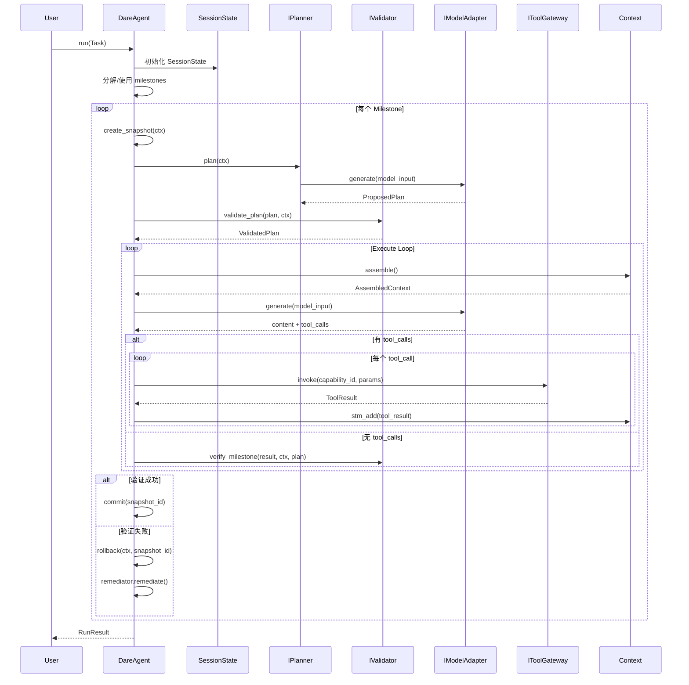
```mermaid
sequenceDiagram
    participant U as User
    participant A as DareAgent
    participant S as SessionState
    participant P as IPlanner
    participant V as IValidator
    participant M as IModelAdapter
    participant T as IToolGateway
    participant C as Context

    U->>A: run(Task)
    A->>S: 初始化 SessionState
    A->>A: 分解/使用 milestones

    loop 每个 Milestone
        A->>A: create_snapshot(ctx)
        A->>P: plan(ctx)
        P->>M: generate(model_input)
        M-->>P: ProposedPlan
        A->>V: validate_plan(plan, ctx)
        V-->>A: ValidatedPlan

        loop Execute Loop
            A->>C: assemble()
            C-->>A: AssembledContext
            A->>M: generate(model_input)
            M-->>A: content + tool_calls
            alt 有 tool_calls
                loop 每个 tool_call
                    A->>T: invoke(capability_id, params)
                    T-->>A: ToolResult
                    A->>C: stm_add(tool_result)
                end
            else 无 tool_calls
                A->>V: verify_milestone(result, ctx, plan)
            end
        end

        alt 验证成功
            A->>A: commit(snapshot_id)
        else 验证失败
            A->>A: rollback(ctx, snapshot_id)
            A->>A: remediator.remediate()
        end
    end

    A-->>U: RunResult
```

### 7.2 单次 Execute Loop 迭代（模型 + 工具）

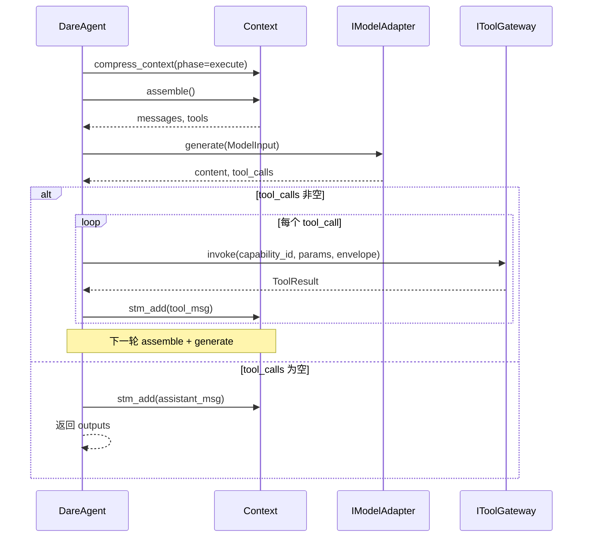
```mermaid
sequenceDiagram
    participant A as DareAgent
    participant C as Context
    participant M as IModelAdapter
    participant T as IToolGateway

    A->>C: compress_context(phase=execute)
    A->>C: assemble()
    C-->>A: messages, tools
    A->>M: generate(ModelInput)
    M-->>A: content, tool_calls

    alt tool_calls 非空
        loop 每个 tool_call
            A->>T: invoke(capability_id, params, envelope)
            T-->>A: ToolResult
            A->>C: stm_add(tool_msg)
        end
        Note over A,C: 下一轮 assemble + generate
    else tool_calls 为空
        A->>C: stm_add(assistant_msg)
        A-->>A: 返回 outputs
    end
```

---

## 8. 状态图

### 8.1 会话状态（CLI 示例）

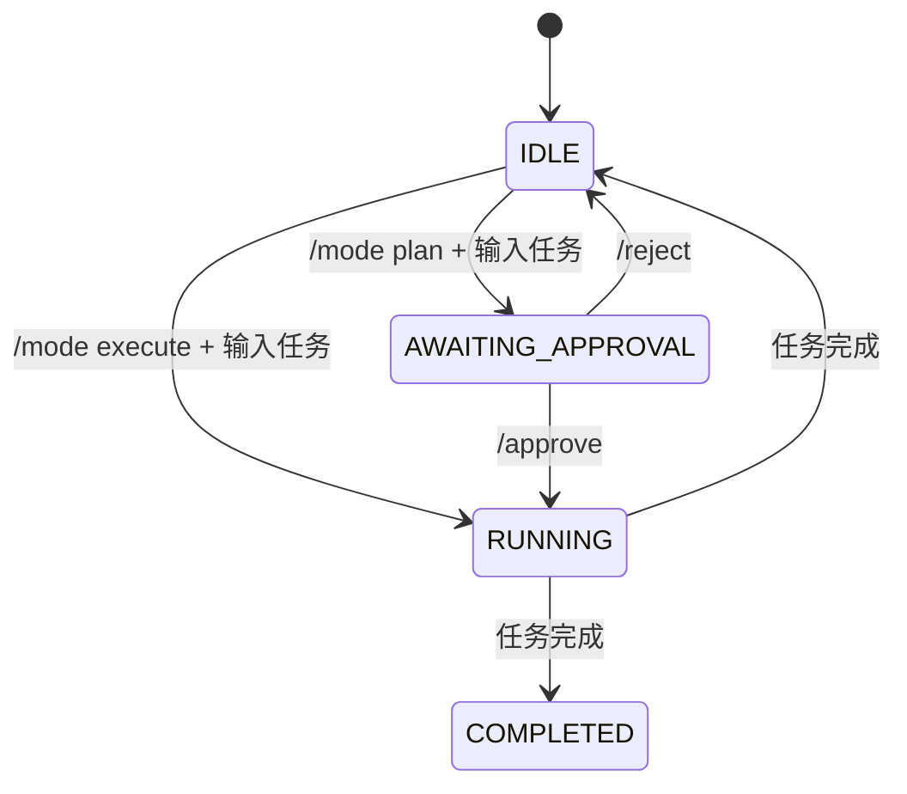
```mermaid
stateDiagram-v2
    [*] --> IDLE
    IDLE --> AWAITING_APPROVAL: /mode plan + 输入任务
    IDLE --> RUNNING: /mode execute + 输入任务
    AWAITING_APPROVAL --> RUNNING: /approve
    AWAITING_APPROVAL --> IDLE: /reject
    RUNNING --> IDLE: 任务完成
    RUNNING --> COMPLETED: 任务完成
```

### 8.2 Milestone 尝试状态

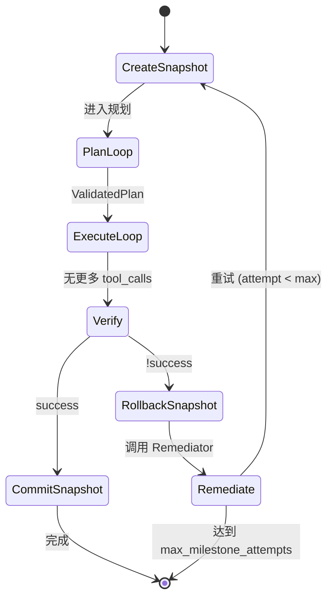
```mermaid
stateDiagram-v2
    [*] --> CreateSnapshot
    CreateSnapshot --> PlanLoop: 进入规划
    PlanLoop --> ExecuteLoop: ValidatedPlan
    ExecuteLoop --> Verify: 无更多 tool_calls
    Verify --> CommitSnapshot: success
    Verify --> RollbackSnapshot: !success
    RollbackSnapshot --> Remediate: 调用 Remediator
    Remediate --> CreateSnapshot: 重试 (attempt < max)
    Remediate --> [*]: 达到 max_milestone_attempts
    CommitSnapshot --> [*]: 完成
```

### 8.3 工具能力风险等级（Trusted Registry）

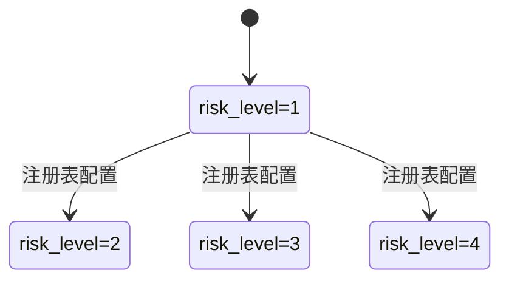
```mermaid
stateDiagram-v2
    [*] --> READ_ONLY
    READ_ONLY: risk_level=1
    IDEMPOTENT_WRITE: risk_level=2
    NON_IDEMPOTENT_EFFECT: risk_level=3
    COMPENSATABLE: risk_level=4

    READ_ONLY --> IDEMPOTENT_WRITE: 注册表配置
    READ_ONLY --> NON_IDEMPOTENT_EFFECT: 注册表配置
    READ_ONLY --> COMPENSATABLE: 注册表配置
```

---

## 9. 示例：05-dare-coding-agent-enhanced

### 9.1 组件组装

| 组件 | 实现 |
|------|------|
| Model | `OpenRouterModelAdapter` |
| Tools | `ReadFileTool`, `WriteFileTool`, `SearchCodeTool`, `RunCommandTool` |
| Planner | `DefaultPlanner` |
| Validator | `FileExistsValidator`（可组合 `RegistryPlanValidator`） |
| Remediator | `DefaultRemediator` |
| Knowledge | `RawDataKnowledge` + `InMemoryRawDataStorage` |
| EventLog | `StreamingEventLog`（CLI 展示用） |

### 9.2 FileExistsValidator 行为

- `validate_plan`：接受所有 ProposedPlan，转为 ValidatedPlan（risk_level=READ_ONLY）。
- `verify_milestone`：从 `plan.steps` 的 `params.expected_files` 提取期望文件，或在无 plan 时使用构造时的 `expected_files`；检查工作区内文件是否存在，决定 `VerifyResult.success`。

### 9.3 CLI 流程

- 支持 `/mode plan` 与 `/mode execute`。
- Plan 模式：输入任务 → 预览规划 → `/approve` 执行或 `/reject` 取消。
- Execute 模式：输入任务 → 直接执行五层循环。

---

## 10. PDF 导出说明

本文档为 Markdown 格式，支持通过以下方式导出 PDF：

1. **Typora**：打开文件 → 文件 → 导出 → PDF  
2. **Pandoc**：`pandoc DARE_FRAMEWORK_DESIGN.md -o DARE_FRAMEWORK_DESIGN.pdf --pdf-engine=xelatex -V CJKmainfont="SimSun"`  
3. **VS Code + Markdown PDF 扩展**：右键 → Markdown PDF: Export (pdf)  
4. **Mermaid 图表**：需使用支持 Mermaid 的渲染器（Typora、GitHub、VS Code 预览等），或先用 Mermaid CLI 将图表渲染为图片再嵌入

---

*文档版本：基于 dare_framework 与 examples/05-dare-coding-agent-enhanced 源码分析*
