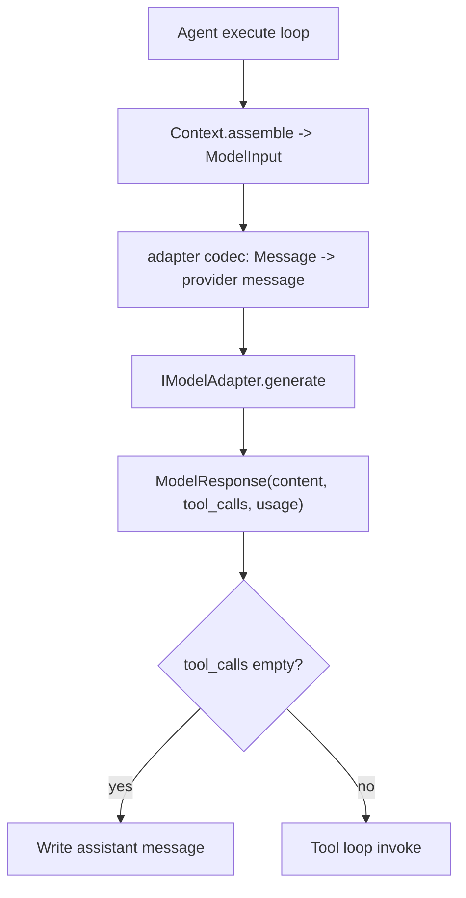

# Module: model

> Status: message-codec boundary updated for canonical rich-media messages (2026-03-09).

## 1. 定位与职责

- 提供统一模型调用抽象：`IModelAdapter.generate`。
- 定义模型输入/输出结构：`ModelInput`、`ModelResponse`。
- 负责把 context domain 的 canonical `Message` 序列化为 provider message。
- 提供 prompt 装载与分层解析能力（store + loader）。

## 2. 依赖与边界

- kernel：`IModelAdapter`
- manager/store 接口：`IModelAdapterManager`, `IPromptLoader`, `IPromptStore`
- 类型：`Prompt`, `ModelInput`, `ModelResponse`, `GenerateOptions`
- 边界约束：
  - model domain 负责“调用与格式适配”，不负责执行循环与工具决策。
  - provider message 仅存在于 adapter 内部，不进入 context/history。
  - adapter 必须消费 canonical `Message`，不得要求上游直接构造 provider-native payload。

## 3. 对外接口（Public Contract）

- `IModelAdapter.generate(model_input, options=None) -> ModelResponse`
- `IModelAdapterManager.load_model_adapter(config=None) -> IModelAdapter | None`
- `IPromptLoader.load() -> list[Prompt]`
- `IPromptStore.get(prompt_id, model=None, version=None) -> Prompt`

## 4. 关键字段（Core Fields）

- `Prompt`
  - `prompt_id`, `role`, `content`, `supported_models`, `order`, `version`, `metadata`
- `ModelInput`
  - `messages: list[Message]`
  - `tools: list[CapabilityDescriptor]`
  - `metadata: dict[str, Any]`
- `ModelResponse`
  - `content: str`
  - `tool_calls: list[dict[str, Any]]`
  - `usage: dict[str, Any] | None`
  - `metadata: dict[str, Any]`
- `GenerateOptions`
  - `temperature`, `max_tokens`, `top_p`, `stop`, `metadata`

canonical `Message` 由 context domain 提供，建议字段口径：

- `id`
- `role`
  - `MessageRole`
- `kind`
  - `MessageKind`
- `text: str | None`
- `attachments: list[AttachmentRef]`
- `data: dict[str, Any] | None`
- `name`
- `metadata`

其中：

- `attachments` 中的附件项必须是强类型 `AttachmentRef`。
- adapter 必须以 `Message.data` 作为 `tool_call/tool_result` 的结构化主语义来源；`metadata` 仅保留非语义附加信息。
- adapter 可以对 `data/metadata` 做 provider-specific codec，但不得把附件重新退化为无约束字典再回传上游。
- 非法 canonical message（例如 `tool_call/tool_result` 缺少 `data`）必须在进入 adapter 前失败，而不是在 adapter 内兜底补语义。

## 5. 关键流程（Runtime Flow）

## 6. 与其他模块的交互

- **Context**
  - 提供 canonical `Message` / tools。
- **Tool**
  - 通过 `tool_calls` 触发 `IToolGateway.invoke`。
- **Transport**
  - transport 不直接参与 provider 序列化；只负责 message/select/action/control envelope。
- **Config**
  - `Config.llm` 决定 adapter 类型与连接参数。
- **Observability**
  - 从 `usage` 提取 token 指标。
- **Session/Memory persistence**
  - adapter 不持久化 provider-native message；resume/replay 必须基于 canonical `Message` 重新序列化。

## 6.1 默认 Adapter 能力矩阵

- `openai`: 基于 `langchain-openai`，适配 OpenAI-compatible Chat 接口。
- `openrouter`: 基于 `openai` SDK，适配 OpenRouter OpenAI-compatible 接口。
- `anthropic`: 基于 `anthropic` 官方 SDK，适配 Anthropic Messages API（模型名透传 + tool blocks）。

## 7. 约束与限制

- 当前流式输出和增量 tool-call 仍是待补齐项。
- tool defs 仍以 OpenAI function-call schema 为主。
- 首版 rich-media 只要求 `chat` 支持 `text + image attachments`；不要求图文混排顺序表达。
- 首版字段约束中，`thinking`、`summary`、`tool_call` 不允许携带附件；`tool_result` 允许附件以支持后续工具富媒体输出。

## 8. TODO / 未决问题

- TODO: 增加 streaming 与多模型路由策略。
- TODO: 明确跨 adapter 的 tool schema 归一化规范。
- TODO: 收敛 adapter client typing，减少 `Any`。
- TODO: 为 `Message.kind=text/attachments/data` 定义跨 adapter 能力矩阵与降级规则。

## 能力状态（landed / partial / planned）

- `landed`: 见文档头部 Status 所述的当前已落地基线能力。
- `partial`: 当前实现可用但仍有 TODO/限制（见“约束与限制”与“TODO / 未决问题”）。
- `planned`: 当前文档中的未来增强项，以 TODO 条目为准，未纳入当前实现承诺。

## 最小标准补充（2026-02-27）

### 总体架构
- 模块实现主路径：`dare_framework/model/`。
- 分层契约遵循 `types.py` / `kernel.py` / `interfaces.py` / `_internal/` 约定；对外语义以本 README 的“对外接口/关键字段/关键流程”章节为准。
- 与全局架构关系：作为 `docs/design/Architecture.md` 中对应 domain 的实现落点，通过 builder 与运行时编排接入。

### 异常与错误处理
- 参数或配置非法时，MUST 显式返回错误（抛出异常或返回失败结果），禁止静默吞错。
- 外部依赖失败（模型/存储/网络/工具）时，优先执行可观测降级策略：记录结构化错误上下文，并在调用边界返回可判定失败。
- 涉及副作用或策略判定的失败路径，MUST 保留审计线索（事件日志或 Hook/Telemetry 记录），以支持回放和排障。

### 测试锚点（Test Anchor）

- `tests/unit/test_default_model_adapter_manager.py`（模型适配器管理与选择）
- `tests/unit/test_openrouter_adapter.py`（adapter 消息序列化与 tool-call 兼容）
- `tests/unit/test_anthropic_model_adapter.py`（Anthropic adapter 请求/响应规范化）
