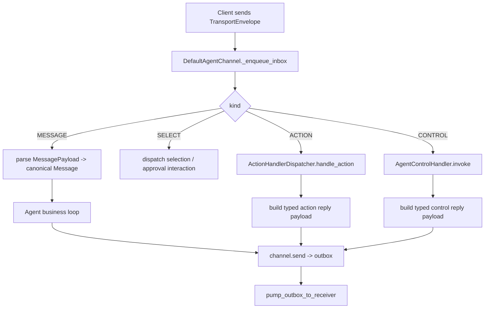

# Module: transport

> Status: message-format redesign baseline updated for typed envelope payloads (2026-03-09).

## 1. 定位与职责

- 提供 Agent 与外部客户端（CLI/Web/API）之间的统一 envelope 通信层。
- 通过 `TransportEnvelope` + `AgentChannel` 屏蔽具体连接协议差异。
- transport 只负责“帧路由与交互分派”，不直接承载 framework message 语义。
- `TransportEnvelope.kind` 只区分协议大类；具体业务语义下沉到 typed payload。

## 2. 依赖与边界

- kernel：`AgentChannel`, `ClientChannel`
- types：`EnvelopeKind`, `TransportEnvelope`, `EnvelopePayload`
- 默认实现：`DefaultAgentChannel`
- interaction 子域：`ActionHandlerDispatcher`, `AgentControlHandler`, payload builders
- 边界约束：
  - transport 负责 envelope 路由、回压、reply 关联，不负责模型/provider 消息格式。
  - `Message` 属于 context domain 的 canonical framework message；transport 不重新定义一套平行 message。
  - action/control/select 的业务执行由 dispatcher/agent handler/交互层提供。

## 3. 对外接口（Public Contract）

- `AgentChannel`
  - `start()`, `stop()`
  - `poll() -> TransportEnvelope | list[TransportEnvelope]`
  - `send(msg: TransportEnvelope)`
  - `add_action_handler_dispatcher(...)`
  - `add_agent_control_handler(...)`
  - `build(client_channel, max_inbox=100, max_outbox=100, action_timeout_seconds=30.0)`
- `ClientChannel`
  - `attach_agent_envelope_sender(sender)`
  - `agent_envelope_receiver() -> Receiver`

## 4. 核心数据结构（Core Data Structures）

### 4.1 `EnvelopeKind`

- 保留现有 4 个协议大类：
  - `MESSAGE`
  - `SELECT`
  - `ACTION`
  - `CONTROL`
- `EnvelopeKind` 不承载细粒度业务语义；`chat/thinking/tool_call/tool_result` 不平铺到这里。

### 4.2 `TransportEnvelope`

建议稳定字段：

- `id`
  - transport frame id；用于 reply/ack/重试/链路追踪。
- `reply_to`
  - 关联上游 frame。
- `kind`
  - envelope 协议大类。
- `payload`
  - typed payload；根据 `kind` 选择对应 payload 家族。
- `meta`
  - transport/runtime 元数据。
- `stream_id`
  - 流式/多帧关联标识。
- `seq`
  - 流式帧序号。

设计收敛结论：

- `event_type` 退出主设计。
- 原先通过 `event_type` 传递的业务语义，应转入 typed payload。
- 如果实施时需要过渡，可短期保留 `event_type` 作为兼容字段，但只能由 payload 单向推导，不允许形成第二真相源。

### 4.3 `EnvelopePayload` 抽象接口

所有 payload 家族共享以下公共字段：

- `id`
  - 语义对象 id；区别于 envelope frame id。
- `metadata`
  - 业务元数据。

### 4.4 Payload 家族

#### `MessagePayload`

- `id`
- `metadata`
- `role`
- `message_kind`
  - 使用确定性枚举 `MessageKind`
  - `CHAT | THINKING | TOOL_CALL | TOOL_RESULT | SUMMARY`
- `text: str | None`
- `attachments: list[AttachmentRef]`
- `data: dict[str, Any] | None`

说明：

- `chat` 使用 `text + attachments` 表达；不再单独引入 `ChatBody`。
- `thinking/summary` 通常只使用 `text`。
- `tool_call/tool_result` 通过 `data` 承载结构化字段，`text` 作为可选人类可读补充。
- `MessagePayload` 可稳定转换为 context domain 的 canonical `Message`。

#### `SelectPayload`

- `id`
- `metadata`
- `select_kind`
  - 使用确定性枚举 `SelectKind`
  - `ASK | ANSWERED`
- `select_domain`
  - 使用确定性枚举 `SelectDomain`
  - `APPROVAL | CHOICE | FORM`
- `prompt`
- `options`
- `selected`

说明：

- `approval.pending` / `approval.resolved` 不再属于 message event；统一回收到 `kind=select`。
- approval 的两阶段语义分别映射为：
  - `ask`
  - `answered`

#### `ActionPayload`

- `id`
- `metadata`
- `resource_action`
- `params`

说明：

- `resource_action` 就是 action 主语义，不再额外引入 `action_kind`/`message_kind`。
- 该字段继续与 `ResourceAction` 对齐解析；是否在 payload 上直接强制为 enum，取决于后续是否允许外部扩展 action id。

#### `ControlPayload`

- `id`
- `metadata`
- `control_id`
- `params`

说明：

- `control_id` 语义上应与 `AgentControl` 一致；当前实现阶段仍保留字符串承载，但后续不应在框架逻辑中散落裸字符串常量。

### 4.5 `AttachmentRef`

首版只要求图片：

- `kind: image`
- `uri`
- `mime_type?`
- `filename?`
- `metadata?`

该结构既可用于 `MessagePayload.attachments`，也可用于 canonical `Message.attachments`。

## 5. 关键流程（Runtime Flow）

## 6. 与其他模块的交互

- **Context**
  - `kind=message` 的 payload 会被归一化为 canonical `Message`。
- **Agent**
  - 通过 `poll/send` 进入 transport loop 或 direct-call 通道。
- **Model**
  - transport 不接触 provider message；provider 序列化只在 adapter 内部发生。
- **Hook/Observability**
  - 通过 envelope/meta 追踪 transport 级事件，不污染 canonical message 结构。
- **Tool/HITL**
  - 审批/选择状态通过 `kind=select` 回传客户端，而不是伪装成 message event。

## 7. 约束与限制

- 默认 channel 为阻塞回压模型，未提供优先级队列。
- 未提供持久化队列与断线恢复机制。
- 本文只定义消息格式与 envelope 结构；`pending delta / active model state / resume rebuild` 不在 transport 设计内处理。

## 8. TODO / 未决问题

- TODO: 支持 reconnect/resume 与 envelope replay。
- TODO: 定义 streaming chunk 的标准 envelope 协议。
- TODO: 为各 payload 家族补齐 schema 校验与版本化。
- TODO: 清理 `TransportEventType` 历史语义，尤其是 `approval.pending/resolved` 向 `SelectPayload` 归位。

## 9. 相关文档

- `docs/design/modules/transport/transport_mvp.md`
- `docs/design/modules/transport/Transport_Domain_Design.md`
- `docs/design/modules/transport/InteractionStreaming.md`

## 能力状态（landed / partial / planned）

- `landed`: 见文档头部 Status 所述的当前已落地基线能力。
- `partial`: 当前实现可用但仍有 TODO/限制（见“约束与限制”与“TODO / 未决问题”）。
- `planned`: 当前文档中的未来增强项，以 TODO 条目为准，未纳入当前实现承诺。

## 最小标准补充（2026-02-27）

### 总体架构
- 模块实现主路径：`dare_framework/transport/` 与 `dare_framework/a2a/`。
- 分层契约遵循 `types.py` / `kernel.py` / `interfaces.py` / `_internal/` 约定；对外语义以本 README 的“对外接口/关键字段/关键流程”章节为准。
- 与全局架构关系：作为 `docs/design/Architecture.md` 中对应 domain 的实现落点，通过 builder 与运行时编排接入。

### 异常与错误处理
- 参数或配置非法时，MUST 显式返回错误（抛出异常或返回失败结果），禁止静默吞错。
- 外部依赖失败（模型/存储/网络/工具）时，优先执行可观测降级策略：记录结构化错误上下文，并在调用边界返回可判定失败。
- 涉及副作用或策略判定的失败路径，MUST 保留审计线索（事件日志或 Hook/Telemetry 记录），以支持回放和排障。

### 测试锚点（Test Anchor）

- `tests/unit/test_transport_channel.py`（transport envelope 收发链路）
- `tests/unit/test_interaction_dispatcher.py`（interaction action/control 分发）
